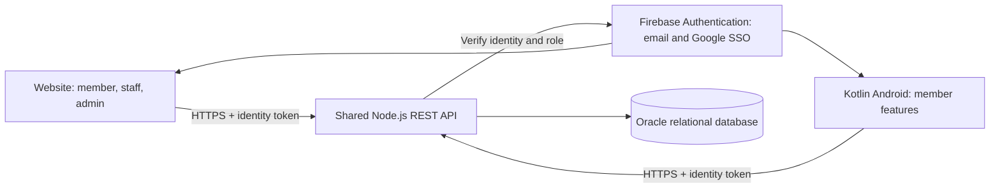

# Website and Android implementation plan

## Architecture decision

Use the existing HTML/CSS/JavaScript website, a native Kotlin Android application, a shared Node.js API, and Oracle Database Free. Oracle preserves the relational design in `final.pdf`; the current module requires relational tables and a working API. WAMP is useful for serving the prototype, but its presence does not make MySQL the agreed database.

Firebase Authentication is the proposed identity service, not the business database. Both clients use one authentication project. The API verifies tokens and maps the stable identity UID to the same member record in Oracle. Users sign in separately on each device but use the same account. Passwords must never be kept in browser storage, source code, or Oracle business tables.

The API owns authorization and business rules. Hiding admin menus is not access control. Staff cannot read admin reports; members can access their own private records only. Only approved public profile fields appear in friend/trainer discovery. Medical details are excluded from social responses.

## How the two clients stay consistent

Example: a member books on Android; the API validates identity, locks/checks the class capacity inside a database transaction, rejects duplicate bookings, commits, then returns confirmation. The website reads the same booking from Oracle through that API. There is no separate phone database to reconcile as the master copy.

Initially refresh on screen entry, successful writes, and foreground resume; add short polling where live capacity is useful. Always show loading, retry, stale-data and offline states. Cache read-only schedules on Android with Room later. A cached class is not proof that a seat is still available. Bookings and payments require an online server confirmation. Use request idempotency keys to avoid duplicate writes after retries; use record versions for conflicting profile updates.

## Build order and exit criteria

1. Setup (this branch): recover source, track requirements, establish Git workflow and baseline checks. The source PDFs remain local references.
2. Database + identity: implement versioned Oracle SQL migrations, foreign keys, uniqueness/check constraints, synthetic seed data (at least ten records per required table), email sign-in and Google SSO. Validate API token verification and role checks.
3. First connected feature: registration, profile and settings on the website and Kotlin app. Pass a real cross-device test: edit on website, reload app, see the same data.
4. Operations: class booking/cancellation, attendance, simulated payment history, paid manual access. Test concurrent attempts for the final seat and unauthorized requests.
5. Remaining scope: trainers and requests, friend connections, admin staff management/reports, public marathon registration, help and error states. Trace each feature to acceptance criteria.
6. Delivery: hosted HTTPS API and database, website deployment, GitHub Actions API tests plus Kotlin JUnit tests/Gradle APK build, signed installable APK, real-phone voice-over demonstration, screenshots, release notes and contribution evidence.

Create Android's actual Gradle project and wrapper in Android Studio at stage 3; do not represent a placeholder folder as a working app. Cloud accounts, hosting availability and zero-cost quotas must be verified before deployment. No cloud resources, SSO provider, database or Android SDK were provisioned by this setup.

## Database entities

AppUser (identity UID and role), Member, MemberPreference, Trainer, FitnessClass, Booking, Attendance, Payment, Exercise, FriendConnection, TrainerRequest, TrainerReview, MarathonEvent and MarathonRegistration. Refine the ERD before writing migrations. Reports should normally be queries/views over these records. Never store a card number. Payments and messages remain explicitly simulated as stated in the newer WIL plan.

## Team work

Use one repository and feature branches; `website/`, `mobile-app/`, `backend/`, `database/`, and `docs/` share reviewed contracts. Do not leave the website and app isolated on permanent branches. Keep Azure Boards updated and link tasks to GitHub PRs. Each member commits and pushes their own work regularly, using meaningful messages; see CONTRIBUTING.md.

## Sources and decisions

- Original project plan: business scope, team roles and R0 budget.
- CFJ final report: localStorage prototype and role/business rules.
- `final.pdf`: actually a DOCX package; older Oracle design is retained, direct client SQL is replaced with an API boundary.
- `wil 1.pdf`: current shared website/app scope, simulated payments, Azure Boards and GitHub Actions.
- XISD POE manual pp. 16-18: Kotlin, SSO, settings, online services, real phone, tests, source and evidence. Its ten-record minimum supersedes the older three-row samples.
- Announcement image: three recorded Teams meetings per week, approximately two hours each, with attendance/minutes and progress tracking.
- Folder image: retain website, mobile-app and docs; extend with backend and database to support the required integration.

Technical references checked 2026-09-28: https://www.oracle.com/database/free/ ; https://node-oracledb.readthedocs.io/en/latest/user_guide/introduction.html ; https://firebase.google.com/docs/auth/admin/verify-id-tokens .
